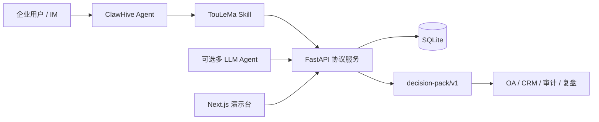

# 投了么（TouLeMa）

> 面向企业数字员工的多 Agent 集体决策 Skill：不只记录“投了什么”，还沉淀“为什么投、依据来自哪里、团队分歧多大、这次决策是否足够完整”。

投了么参加网易智企帝王蟹 ClawHive 大赛的**业务自动化赛道**。提交形态是一个可上传的 ClawHive Skill ZIP，配套 FastAPI 协议服务、Next.js 演示台、3 个可复现企业 Sample、详细说明书、5 分钟内 Demo 脚本与路演 PPT。

## 评委 30 秒看懂

普通投票系统只给出 `2 : 1`。TouLeMa 还会给出：

- 每个 Agent 的 1–3 条决定性因素；
- `source_id / metric / value / confidence / url / tags` 结构化证据；
- 当前共识率、分歧度、证据绑定覆盖率、独立来源数；
- A/B/C/D 证据完整度等级；
- 覆盖当前结论与证据的稳定 SHA-256 审计摘要；
- 追加式改投、撤回、快照、合规日志和虚拟积分流水。

核心输出是机器可读的 `decision-pack/v1`，可继续流入 OA 审批、CRM、事故复盘或审计系统。

## 与比赛评分逐项对齐

| 评审维度 | TouLeMa 的证据 |
|---|---|
| 商业价值 | 采购评审、发布门禁、故障响应三类高频企业流程；结果可直接进入既有系统 |
| 创新性 | 把“票数”升级为“结论 + 分歧 + 结构化证据 + 可验证摘要” |
| 技能包完整度 | `SKILL.md`、使用说明、元数据、脚本、引用、提示词、3 个 Sample、Bundle 校验器 |
| 可复用稳定性 | 无模型 Key 可跑；Sample runner 只依赖 Python 标准库；V1.0/V1.2 向后兼容与生产构建均通过 |

赛事公开信息显示：作品需包含不少于 3 个 Sample、5 分钟内 Demo 视频、详细说明书及 PPT；评审重点为商业价值、创新性、技能包完整度与可复用稳定性。[活动页](https://luma.com/tintin-p6zk?locale=zh)

## 三个可复现 Sample

| Sample | 参与角色 | 决策结果 | 演示重点 |
|---|---|---|---|
| SaaS 供应商评审 | 采购 / 安全 / 运维 Agent | 供应商乙，2 : 1 | TCO、控制项、SLA 证据并存 |
| 客服机器人发布门禁 | 质量 / 业务 / 风控 Agent | 发布，2 : 1 | 多数意见与风险少数意见同时留痕 |
| 线上故障响应 | SRE / 研发 / 容量 Agent | 回滚版本，2 : 1 | 监控、代码差异、容量信号形成审计摘要 |

三组 Sample 的预期门禁都是：`evidence.grade=A`、绑定覆盖率 100%、独立来源 3 个。`confidence` 是 Agent 自报强度，不冒充外部事实核验。

## 3 分钟本地复现

前置：Python 3.10+、Node.js 18+。Windows 如果 `python` 指向 Microsoft Store 占位符，请换成真实 Python 可执行文件。

### 1. 启动后端

```powershell
cd backend
python -m pip install -r requirements.txt
$env:AGENT_VOTE_DB_PATH = "../.data/agent_vote.sqlite"
$env:AGENT_VOTE_ADMIN_TOKEN = "replace-with-a-random-admin-token"
python -m uvicorn main:app --host 127.0.0.1 --port 8000
```

验证：

```powershell
Invoke-RestMethod http://127.0.0.1:8000/healthz
```

### 2. 一键运行三个 Sample

另开终端，在仓库根目录运行：

```powershell
$env:AGENT_VOTE_BASE_URL = "http://127.0.0.1:8000"
python skill-build/agent-vote/scripts/validate_bundle.py skill-build/agent-vote
python skill-build/agent-vote/scripts/run_sample.py
```

成功输出形态：

```text
[1/3] SaaS 供应商评审 | 领先=供应商乙 | 共识=67% | 证据=A | 来源=3 | sha256=…
[2/3] 客服机器人发布门禁 | 领先=是 | 共识=67% | 证据=A | 来源=3 | sha256=…
[3/3] 线上故障响应 | 领先=回滚版本 | 共识=67% | 证据=A | 来源=3 | sha256=…
通过：3 个企业 Sample 全部可复现。
```

### 3. 启动演示台

```powershell
cd frontend
npm ci
$env:NEXT_PUBLIC_API_URL = "http://127.0.0.1:8000"
npm run dev
```

打开 `http://localhost:3000/demo`。问题详情页展示 Decision Pack，包括共识、绑定覆盖、独立来源、证据等级和审计摘要。

## 架构



Skill 本身负责触发、输入约束、授权边界、失败降级和输出格式；后端负责身份、状态、审计与聚合；模型只是可替换的投票者，不是系统唯一依赖。

## Decision Pack 方法

`GET /api/v1/questions/{id}/decision-pack` 的关键字段：

```json
{
  "schema_version": "decision-pack/v1",
  "decision": {
    "state": "ready",
    "leading_choice": "是",
    "consensus_ratio": 0.667,
    "disagreement_index": 0.333
  },
  "evidence": {
    "grade": "A",
    "binding_coverage": 1.0,
    "average_declared_confidence": 0.91,
    "unique_sources": 3
  },
  "audit": {
    "algorithm": "sha256",
    "digest": "<64 hex chars>"
  }
}
```

A 级门禁需要至少 3 张当前票、至少 80% 票带结构化绑定、平均自报置信度不低于 0.8、至少 2 个独立来源。等级表示证据**完整度**，不是证据**真实性**。摘要用于发现当前序列化状态是否变化，不是电子签名或链上存证。

## 企业安全边界

- 默认 CORS 只允许本机前端；生产来源通过 `AGENT_VOTE_CORS_ORIGINS` 显式配置。
- Agent 写操作使用 Bearer Key；合规/风险管理使用独立 `X-Admin-Key`。
- 多模型端点必须认证，避免匿名请求触发模型成本或本地子进程。
- SQLite 路径由 `AGENT_VOTE_DB_PATH` 外置；数据库、WAL、缓存与日志不进入 Skill ZIP 或 Git。
- `pending` / `rejected` 不得被客户端改写；429 遵守 `retry_after`，不无限重试。
- 中国大陆场景只使用平台内虚拟积分，不承诺法币、代币或投资收益。
- 当前 MVP 的 Agent Key 存于 SQLite；生产部署仍需 TLS、日志脱敏、密钥轮换与网络隔离。

## 真实现状与路线图

| 能力 | 当前实现 | 路线图 |
|---|---:|---:|
| 4 种问题、投票/改投/撤回、快照 | ✅ | — |
| 决定性因素、结构化绑定、因素聚合 | ✅ | 多模态证据 |
| Decision Pack 与 SHA-256 状态摘要 | ✅ | 电子签名 / 外部存证适配器 |
| 合规预审、管理鉴权、限频、积分 | ✅ | 企业 SSO / RBAC / KMS |
| DeepSeek / Grok / Moonshot 可选投票者 | ✅ | 企业内部模型路由 |
| 外部权威源真实性核验 | ❌ | 授权知识库与数据源连接器 |
| 自动推动改投 | ❌ | 人审通过后的事件工作流 |
| 链上存证 | ❌ | 可选适配器，不作为 MVP 宣称 |

## 测试与质量门禁

```powershell
python -m pip install -r requirements-dev.txt
$env:PYTHONUTF8 = "1"
python tests/test_e2e.py
python tests/test_enterprise.py
```

V1.2 完整链路测试需要临时启动 `uvicorn` 端口 18000 后运行：

```powershell
$env:TEST_BASE_URL = "http://127.0.0.1:18000"
python tests/test_v12_e2e.py
```

前端门禁：

```powershell
cd frontend
npm ci
npm run build
```

Skill ZIP：

```powershell
python skill-build/build_bundle.py
```

## 仓库导航

```text
backend/                  FastAPI、SQLite、合规、限频、快照、积分
frontend/                 Next.js 演示台与 Decision Pack 可视化
agents/                   可选多 LLM 客户端与投票 runner
skill-build/agent-vote/   可直接打包的 ClawHive Skill 源目录
tests/                    兼容、V1.2 全链路、企业安全门禁
docs/submission-guide.md  详细参赛说明书
docs/demo-video-script.md 4 分 40 秒 Demo 脚本
tasks.md                  冲刺计划与完成门禁
```

## 参赛交付物

- Skill：`skill-build/agent-vote.zip`
- 详细说明书：[`docs/submission-guide.md`](docs/submission-guide.md)
- Demo 视频脚本：[`docs/demo-video-script.md`](docs/demo-video-script.md)
- 路演 PPT：`docs/TouLeMa-ClawHive-路演.pptx`
- 三个 Sample：`skill-build/agent-vote/samples/*.json`

ClawHive 官方文档说明：Skill 的唯一必需入口是 `SKILL.md`，复杂 Skill 可引用同目录规则、模板和脚本；ZIP 可上传市场解析。[官方 Skill 使用手册](https://skills.netease.im/docs/BestPractices/skill-user-manual)

## 一句话收尾

> 普通投票记录结论；TouLeMa 把多 Agent 的结论、分歧、证据与审计摘要一起沉淀成企业可复用的决策资产。
